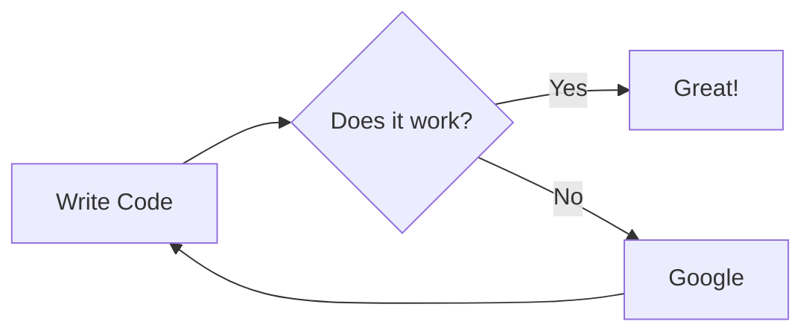

 - _:androidApp has presentation and navigation layer as package (not module)_
 - _:kmm-shared has domain and data layer as package (not module)_

 - :androidApp (presentation)
    - :feature-login-public
    - :feature-login-impl
    - :feature-login-impl-wiring

:feature-login:public <- :feature-login:impl <- :feature-login:impl-wiring

# TODO
[comment]: <> (For second MVP :feature-login:fake)
[comment]: <> (:For Second MVP :feature-login:fake-wiring)
[comment]: <> (:For Second MVP ::feature-login:demo)

___

 - :kmm-shared (domain & data)
    - :feature-sign-up-public
    - :feature-sign-up-impl
    - :feature-sign-up-impl-wiring

___

Sources: 
 - [Android Showcase](https://github.com/igorwojda/android-showcase)
 - [Android at Scale | Video](https://www.droidcon.com/media-detail?video=380843878)
 - [Android at Scale | Slideshow](https://speakerdeck.com/vrallev/android-at-scale-at-square)
 
 graph TD;
     A-->B;
     A-->C;
     B-->D;
     C-->D;
     
     
graph TD
    A[Christmas] -->|Get money| B(Go shopping)
    B --> C{Let me think}
    C -->|One| D[222222]
    C -->|Two| E[iPhone]
    C -->|Three| F[fa:fa-car Car]